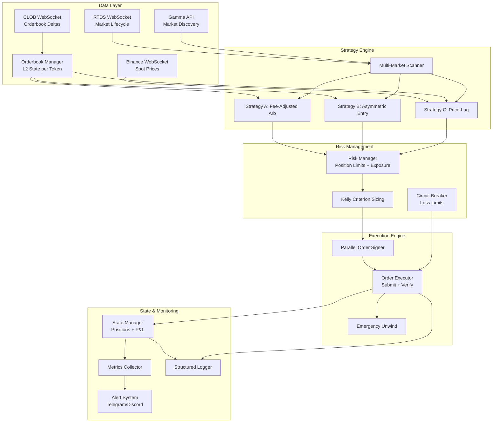

# Polymarket 15-Minute Crypto Trading Bot — Implementation Plan

> **Status:** Phase 2 complete, ready for Phase 3
> **Last updated:** 2026-02-04

---

## Table of Contents

1. [Architecture Overview](#1-architecture-overview)
2. [Module Structure & Interfaces](#2-module-structure--interfaces)
3. [Data Flow Diagrams](#3-data-flow-diagrams)
4. [Strategy Specifications](#4-strategy-specifications)
5. [Execution Engine Design](#5-execution-engine-design)
6. [Risk Management Design](#6-risk-management-design)
7. [Configuration Schema](#7-configuration-schema)
8. [Risk Matrix](#8-risk-matrix)
9. [Testing Strategy](#9-testing-strategy)
10. [Phased Implementation](#10-phased-implementation)
11. [Open Questions](#11-open-questions)

---

## 1. Architecture Overview

### High-Level Architecture (Mermaid)



### Design Principles

1. **Async-first:** All I/O operations use asyncio. The synchronous py-clob-client is wrapped with `asyncio.to_thread()`.
2. **Event-driven:** WebSocket feeds push events; strategies react to state changes, not polling loops.
3. **Modular strategies:** Each strategy is a pluggable module implementing a common interface. The scanner dispatches opportunities to the best available strategy.
4. **Defense in depth:** Risk checks at strategy level (should I trade?), execution level (can I trade?), and circuit breaker level (am I allowed to trade?).
5. **Fail-safe:** On any unhandled error, the system attempts to flatten all positions before shutting down.

---

## 2. Module Structure & Interfaces

### 2.1 Configuration (`src/config.py`)

```python
from pydantic_settings import BaseSettings
from pydantic import Field, SecretStr
from enum import IntEnum

class SignatureType(IntEnum):
    EOA = 0
    POLY_GNOSIS_SAFE = 1
    GNOSIS_SAFE = 2

class Settings(BaseSettings):
    # === Wallet & Auth ===
    private_key: SecretStr
    signature_type: SignatureType = SignatureType.POLY_GNOSIS_SAFE
    funder: str = ""  # Proxy wallet for Magic.link accounts

    # === API Endpoints ===
    clob_host: str = "https://clob.polymarket.com"
    clob_ws_url: str = "wss://ws-subscriptions-clob.polymarket.com/ws/market"
    rtds_ws_url: str = "wss://ws-live-data.polymarket.com"
    gamma_api_url: str = "https://gamma-api.polymarket.com"
    binance_ws_url: str = "wss://stream.binance.com:9443/ws"

    # === Trading Parameters ===
    order_size: float = 50.0         # Shares per side
    order_type: str = "FOK"          # FOK, FAK, GTC
    target_pair_cost: float = 0.94   # Max combined YES+NO cost for arb
    min_profit_margin: float = 0.005 # Min net profit per share after fees
    cooldown_seconds: float = 5.0    # Min seconds between executions per market

    # === Strategy Toggles ===
    enable_arbitrage: bool = True
    enable_asymmetric: bool = False
    enable_price_lag: bool = False
    enable_multi_market: bool = True

    # === Markets ===
    markets: list[str] = ["BTC", "ETH", "SOL", "XRP"]
    market_slug_override: str = ""  # Manual slug override

    # === Risk Limits ===
    max_position_per_market: float = 500.0    # Max USD exposure per market
    max_total_position: float = 2000.0         # Max USD total exposure
    max_daily_loss: float = 50.0               # Daily loss limit (USD)
    max_unhedged_exposure: float = 100.0       # Max directional exposure (USD)

    # === Simulation ===
    dry_run: bool = False
    sim_balance: float = 1000.0

    # === Monitoring ===
    telegram_bot_token: str = ""
    telegram_chat_id: str = ""
    discord_webhook_url: str = ""
    alert_on_trade: bool = True
    alert_on_error: bool = True
    daily_summary_hour: int = 0  # UTC hour for daily summary

    # === Operational ===
    log_level: str = "INFO"
    log_format: str = "json"  # "json" or "console"
    neg_risk: bool = True  # Hardcoded True for 15-min crypto markets

    model_config = {"env_prefix": "BOT_", "env_file": ".env"}
```

### 2.2 Core Models (`src/core/models.py`)

```python
from dataclasses import dataclass, field
from datetime import datetime
from enum import Enum
from typing import Optional

class Side(str, Enum):
    BUY = "BUY"
    SELL = "SELL"

class StrategyType(str, Enum):
    ARBITRAGE = "arbitrage"
    ASYMMETRIC = "asymmetric"
    PRICE_LAG = "price_lag"

class OrderStatus(str, Enum):
    PENDING = "pending"
    SIGNED = "signed"
    SUBMITTED = "submitted"
    FILLED = "filled"
    PARTIALLY_FILLED = "partially_filled"
    CANCELLED = "cancelled"
    REJECTED = "rejected"
    EXPIRED = "expired"

@dataclass
class Market:
    condition_id: str
    slug: str
    question: str
    yes_token_id: str
    no_token_id: str
    start_time: datetime
    end_time: datetime
    asset: str  # "BTC", "ETH", "SOL", "XRP"
    neg_risk: bool = True

@dataclass
class OrderBookLevel:
    price: float
    size: float

@dataclass
class OrderBook:
    token_id: str
    bids: list[OrderBookLevel]  # Sorted descending by price
    asks: list[OrderBookLevel]  # Sorted ascending by price
    timestamp_ms: int = 0
    hash: str = ""

    @property
    def best_bid(self) -> Optional[float]:
        return self.bids[0].price if self.bids else None

    @property
    def best_ask(self) -> Optional[float]:
        return self.asks[0].price if self.asks else None

    @property
    def spread(self) -> Optional[float]:
        if self.best_bid is not None and self.best_ask is not None:
            return self.best_ask - self.best_bid
        return None

@dataclass
class FillEstimate:
    """Result of walking the orderbook to fill a given size."""
    filled_size: float
    total_cost: float
    vwap: float            # Volume-weighted average price
    worst_price: float     # Most expensive level touched
    best_price: float      # Cheapest level touched
    levels_consumed: int
    sufficient_liquidity: bool

@dataclass
class Opportunity:
    strategy: StrategyType
    market: Market
    timestamp: datetime
    # Strategy-specific fields
    yes_fill: Optional[FillEstimate] = None
    no_fill: Optional[FillEstimate] = None
    expected_profit: float = 0.0
    expected_profit_pct: float = 0.0
    total_fees: float = 0.0
    confidence: float = 0.0  # 0.0 to 1.0
    metadata: dict = field(default_factory=dict)

@dataclass
class TradeOrder:
    token_id: str
    side: Side
    price: float
    size: float
    order_type: str = "FOK"
    # Filled by executor
    order_id: Optional[str] = None
    status: OrderStatus = OrderStatus.PENDING
    signed_order: Optional[dict] = None
    fill_size: float = 0.0
    fill_price: float = 0.0

@dataclass
class Position:
    market: Market
    yes_shares: float = 0.0
    no_shares: float = 0.0
    yes_cost_basis: float = 0.0
    no_cost_basis: float = 0.0
    strategy: StrategyType = StrategyType.ARBITRAGE
    opened_at: Optional[datetime] = None

    @property
    def total_investment(self) -> float:
        return self.yes_cost_basis + self.no_cost_basis

    @property
    def is_hedged(self) -> bool:
        return self.yes_shares > 0 and self.no_shares > 0

    @property
    def net_directional_exposure(self) -> float:
        return abs(self.yes_cost_basis - self.no_cost_basis)

@dataclass
class DailyPnL:
    date: str
    trades: int = 0
    gross_profit: float = 0.0
    total_fees: float = 0.0
    net_profit: float = 0.0
    opportunities_seen: int = 0
    opportunities_taken: int = 0
    max_drawdown: float = 0.0
```

### 2.3 State Manager (`src/core/state.py`)

```python
class StateManager:
    """Thread-safe global state for positions, P&L, and market tracking."""

    def __init__(self, settings: Settings) -> None: ...

    # Position tracking
    def add_position(self, position: Position) -> None: ...
    def update_position(self, market_id: str, **kwargs) -> None: ...
    def get_position(self, market_id: str) -> Optional[Position]: ...
    def get_all_positions(self) -> list[Position]: ...
    def close_position(self, market_id: str, payout: float) -> None: ...

    # Exposure queries
    def total_exposure(self) -> float: ...
    def market_exposure(self, market_id: str) -> float: ...
    def total_unhedged_exposure(self) -> float: ...

    # P&L tracking
    def record_trade(self, opportunity: Opportunity, orders: list[TradeOrder]) -> None: ...
    def record_fee(self, amount: float, fee_type: str) -> None: ...
    def daily_pnl(self) -> DailyPnL: ...
    def lifetime_pnl(self) -> dict: ...

    # Persistence (JSON file for crash recovery)
    def save_snapshot(self) -> None: ...
    def load_snapshot(self) -> None: ...
```

### 2.4 Data Layer Interfaces

```python
# === src/data/orderbook.py ===
class L2BookState:
    """In-memory L2 orderbook state for a single token."""
    def __init__(self, token_id: str) -> None: ...
    def apply_snapshot(self, bids: list[dict], asks: list[dict]) -> None: ...
    def apply_delta(self, price_changes: list[dict]) -> None: ...
    def to_orderbook(self) -> OrderBook: ...
    def compute_fill(self, side: Side, target_size: float) -> FillEstimate: ...

class OrderBookManager:
    """Manages L2 books for all tracked tokens."""
    def __init__(self) -> None: ...
    def get_book(self, token_id: str) -> Optional[OrderBook]: ...
    def get_fill_estimate(self, token_id: str, side: Side, size: float) -> Optional[FillEstimate]: ...


# === src/data/clob_ws.py ===
class ClobWebSocket:
    """WebSocket client for CLOB orderbook feed."""
    def __init__(self, ws_url: str, book_manager: OrderBookManager) -> None: ...
    async def connect(self) -> None: ...
    async def subscribe(self, token_ids: list[str]) -> None: ...
    async def unsubscribe(self, token_ids: list[str]) -> None: ...
    async def run(self) -> AsyncGenerator[tuple[str, str], None]: ...
    # Yields (token_id, event_type) on each update


# === src/data/binance_ws.py ===
class BinanceWebSocket:
    """WebSocket client for Binance spot price feeds."""
    def __init__(self, ws_url: str, symbols: list[str]) -> None: ...
    async def connect(self) -> None: ...
    async def run(self) -> AsyncGenerator[SpotPriceUpdate, None]: ...
    def get_price(self, symbol: str) -> Optional[float]: ...
    def get_price_history(self, symbol: str, window_seconds: int) -> list[tuple[float, float]]: ...
    # Returns list of (timestamp, price) tuples


# === src/data/market_discovery.py ===
class MarketDiscovery:
    """Discovers and tracks active 15-minute crypto markets."""
    def __init__(self, settings: Settings) -> None: ...
    async def find_active_markets(self) -> list[Market]: ...
    async def find_market_by_slug(self, slug: str) -> Optional[Market]: ...
    async def get_next_market(self, asset: str) -> Optional[Market]: ...
    def compute_slug(self, asset: str, timestamp: int) -> str: ...
    # Slug format: {asset}-updown-15m-{unix_ts_aligned_to_900}
```

### 2.5 Strategy Interface

```python
# === src/strategy/base.py ===
from abc import ABC, abstractmethod

class BaseStrategy(ABC):
    """Abstract base for all trading strategies."""

    def __init__(self, settings: Settings, state: StateManager,
                 book_manager: OrderBookManager) -> None: ...

    @abstractmethod
    async def evaluate(self, market: Market) -> Optional[Opportunity]:
        """Evaluate a market for trading opportunity. Returns None if no opportunity."""
        ...

    @abstractmethod
    def should_exit(self, position: Position, market: Market) -> bool:
        """Check if an existing position should be exited."""
        ...

    @property
    @abstractmethod
    def name(self) -> str: ...

    @property
    @abstractmethod
    def strategy_type(self) -> StrategyType: ...
```

### 2.6 Execution Engine

```python
# === src/execution/executor.py ===
class OrderExecutor:
    """Handles order signing, submission, and fill verification."""

    def __init__(self, settings: Settings, state: StateManager) -> None: ...

    async def execute_opportunity(self, opp: Opportunity) -> list[TradeOrder]:
        """Execute a full trade opportunity (may involve multiple orders)."""
        ...

    async def sign_order(self, order: TradeOrder) -> TradeOrder:
        """Sign a single order (runs in thread pool due to sync SDK)."""
        ...

    async def sign_orders_parallel(self, orders: list[TradeOrder]) -> list[TradeOrder]:
        """Sign multiple orders concurrently using thread pool."""
        ...

    async def submit_batch(self, orders: list[TradeOrder]) -> list[TradeOrder]:
        """Submit pre-signed orders as a batch."""
        ...

    async def verify_fill(self, order: TradeOrder, timeout: float = 3.0) -> TradeOrder:
        """Poll order status until terminal state."""
        ...

    async def cancel_order(self, order_id: str) -> bool: ...
    async def cancel_all(self) -> bool: ...


# === src/execution/unwind.py ===
class EmergencyUnwind:
    """Handles emergency position flattening."""

    def __init__(self, executor: OrderExecutor, state: StateManager) -> None: ...

    async def unwind_position(self, position: Position) -> bool:
        """Attempt to sell all shares in a position at best available prices."""
        ...

    async def flatten_all(self) -> dict[str, bool]:
        """Emergency: flatten every open position."""
        ...
```

### 2.7 Risk Management

```python
# === src/risk/manager.py ===
class RiskManager:
    """Pre-trade risk checks and exposure monitoring."""

    def __init__(self, settings: Settings, state: StateManager) -> None: ...

    def check_opportunity(self, opp: Opportunity) -> tuple[bool, str]:
        """Returns (approved, reason). Checks position limits, exposure, daily loss."""
        ...

    def adjust_size(self, opp: Opportunity) -> float:
        """Adjust order size based on current exposure and limits."""
        ...

    def is_circuit_breaker_active(self) -> bool: ...


# === src/risk/sizing.py ===
class PositionSizer:
    """Kelly criterion and edge-based position sizing."""

    def __init__(self, settings: Settings, state: StateManager) -> None: ...

    def kelly_size(self, edge: float, odds: float, bankroll: float) -> float:
        """Full Kelly sizing. Returns recommended position in USD."""
        ...

    def fractional_kelly(self, edge: float, odds: float, bankroll: float,
                         fraction: float = 0.25) -> float:
        """Conservative quarter-Kelly sizing."""
        ...
```

### 2.8 Fee Calculation (`src/utils/fees.py`)

```python
# Constants (verify against live platform before deployment)
TAKER_FEE_MAX_RATE = 0.0315   # 3.15% at 50/50 odds
WINNER_FEE_RATE = 0.02        # 2% on profits at resolution
MAKER_FEE_RATE = 0.0          # 0% for limit orders

def taker_fee(price: float) -> float:
    """Calculate taker fee rate for a given price (0.0 to 1.0)."""
    return TAKER_FEE_MAX_RATE * 4.0 * price * (1.0 - price)

def taker_fee_amount(price: float, size: float) -> float:
    """Calculate absolute taker fee in USD."""
    return taker_fee(price) * price * size

def winner_fee_amount(cost_basis: float, payout: float) -> float:
    """Calculate winner fee at resolution."""
    profit = max(0.0, payout - cost_basis)
    return WINNER_FEE_RATE * profit

def net_arb_profit(yes_price: float, no_price: float, size: float) -> float:
    """Calculate net profit for a YES+NO arbitrage after all fees."""
    gross = (1.0 - yes_price - no_price) * size
    taker_yes = taker_fee_amount(yes_price, size)
    taker_no = taker_fee_amount(no_price, size)
    # Winner fee: one side always wins. Fee on the cheaper side (higher profit).
    cheaper = min(yes_price, no_price)
    winner = winner_fee_amount(cheaper, 1.0)  # Per share
    total_winner_fee = winner * size
    return gross - taker_yes - taker_no - total_winner_fee

def min_spread_for_arb(price: float) -> float:
    """Minimum YES+NO combined cost for profitable arbitrage at a given price point."""
    # Solve: net_arb_profit(price, 1-spread_complement, 1) > 0
    # Returns the max combined YES+NO cost that yields positive profit.
    # Binary search or analytical solution.
    ...
```

---

## 3. Data Flow Diagrams

### 3.1 Strategy A: Fee-Adjusted Pure Arbitrage

```
CLOB WebSocket
    │
    ├─► L2 Book (YES token)  ─┐
    │                          ├─► compute_fill(BUY, size) for YES
    └─► L2 Book (NO token)   ─┤   compute_fill(BUY, size) for NO
                               │
                               ▼
                    ┌─────────────────────┐
                    │  Arbitrage Strategy  │
                    │                     │
                    │  1. worst_yes + worst_no = total_cost
                    │  2. taker_fee(yes) + taker_fee(no) = total_taker
                    │  3. winner_fee(min(yes,no)) = winner_cost
                    │  4. net = 1.0 - total_cost - total_taker - winner_cost
                    │  5. if net > min_profit_margin → Opportunity
                    └──────────┬──────────┘
                               │
                               ▼
                    ┌─────────────────────┐
                    │   Risk Manager       │
                    │   → Position limits  │
                    │   → Daily loss check │
                    │   → Adjust size      │
                    └──────────┬──────────┘
                               │
                               ▼
                    ┌─────────────────────┐
                    │  Parallel Signer     │
                    │  → Sign YES BUY      │  ← asyncio.to_thread()
                    │  → Sign NO BUY       │  ← asyncio.to_thread()
                    │  (concurrent ~1s)    │
                    └──────────┬──────────┘
                               │
                               ▼
                    ┌─────────────────────┐
                    │  Batch Submit (FOK)  │
                    │  → post_orders([])   │
                    │  → verify_fill()     │
                    │  → if partial: unwind│
                    └──────────┬──────────┘
                               │
                               ▼
                    State Manager (record position + P&L)
```

### 3.2 Strategy B: Asymmetric Entry (Accumulation)

```
CLOB WebSocket
    │
    └─► L2 Book updates ──► Asymmetric Strategy
                                    │
                    ┌───────────────┴───────────────┐
                    │                               │
              YES unusually cheap?            NO unusually cheap?
              (ask < threshold)              (ask < threshold)
                    │                               │
                    ▼                               ▼
            Buy YES shares                   Buy NO shares
            (limit order, GTC)              (limit order, GTC)
                    │                               │
                    └───────────┬───────────────────┘
                                │
                                ▼
                    Track running cost basis per side
                    accumulated_yes_cost / accumulated_yes_shares
                    accumulated_no_cost / accumulated_no_shares
                                │
                                ▼
                    ┌───────────────────────────────┐
                    │ Check: can we complete a pair? │
                    │                               │
                    │ avg_yes_cost + avg_no_cost     │
                    │ < 1.0 - all_fees - buffer?    │
                    │                               │
                    │ YES → stop accumulating,      │
                    │       position is locked in   │
                    │                               │
                    │ NO  → keep accumulating       │
                    │       the cheaper side        │
                    └───────────────────────────────┘
```

### 3.3 Strategy C: Price-Lag Exploitation

```
Binance WebSocket                      CLOB WebSocket
(BTC/USDT spot)                        (Polymarket 15m market)
    │                                       │
    ▼                                       ▼
Rolling Price Buffer                   Current YES/NO prices
(last 60s of ticks)                    (from L2 book)
    │                                       │
    ▼                                       │
┌──────────────────────┐                    │
│ Detect spot movement │                    │
│ > threshold (0.1-0.2%)│                   │
│ in short window       │                   │
│ (5-30 seconds)        │                   │
└──────────┬───────────┘                    │
           │                                │
           ▼                                │
    ┌──────────────────┐                    │
    │ Compare to       │◄───────────────────┘
    │ Polymarket odds  │
    │                  │
    │ Spot says UP →   │
    │ PM YES should    │
    │ be higher        │
    │                  │
    │ Delta > threshold│
    │ → Opportunity    │
    └──────┬───────────┘
           │
           ▼
    Directional entry:
    Buy YES (if spot moved up)
    Buy NO (if spot moved down)

    With time-aware sizing:
    - >5min to expiry: full size
    - 2-5min: half size
    - <2min: quarter size
    - <30s: DO NOT TRADE (dead zone)
```

### 3.4 Strategy D: Multi-Market Scanner

```
Gamma API (polling every 30s)
    │
    ▼
┌─────────────────────────────────────┐
│ Market Discovery                     │
│                                     │
│ For each asset [BTC, ETH, SOL, XRP]:│
│   1. Compute expected slug          │
│   2. Validate via Gamma API         │
│   3. Extract token IDs              │
│   4. Subscribe to WebSocket feed    │
└─────────────────┬───────────────────┘
                  │
                  ▼
┌─────────────────────────────────────┐
│ Parallel Strategy Evaluation        │
│                                     │
│ For each active market:             │
│   → Run Strategy A (arb)           │
│   → Run Strategy B (asymmetric)    │
│   → Run Strategy C (price-lag)     │
│                                     │
│ Collect all opportunities           │
│ Sort by: net_profit_pct DESC        │
│ Filter by: risk limits             │
└─────────────────┬───────────────────┘
                  │
                  ▼
        Execute best opportunity
        (one at a time, respecting rate limits)
```

---

## 4. Strategy Specifications

### 4.1 Strategy A: Fee-Adjusted Pure Arbitrage

**Trigger:** YES ask + NO ask < dynamic threshold (accounting for all fees)

**Key parameters:**
- `min_net_profit`: Minimum net profit per share after taker fees + winner fee (default: $0.005)
- `max_combined_cost`: Hard ceiling on YES+NO combined cost (default: $0.94)
- `order_type`: FOK (fill-or-kill to prevent one-leg exposure)

**Fee-adjusted threshold calculation:**
```
For YES_price and NO_price:
  gross_profit = 1.0 - YES_price - NO_price
  taker_cost = taker_fee(YES_price) * YES_price + taker_fee(NO_price) * NO_price
  winner_cost = 0.02 * (1.0 - min(YES_price, NO_price))
  net_profit = gross_profit - taker_cost - winner_cost
  → Trade only if net_profit > min_net_profit
```

**Execution:** Sign both orders in parallel → batch submit as FOK → verify fills → if partial, unwind.

### 4.2 Strategy B: Asymmetric Entry

**Concept:** Instead of buying both sides simultaneously, accumulate cheap shares on one side over time. When the average cost of accumulated shares makes a profitable pair, the position is locked in.

**Key parameters:**
- `yes_cheap_threshold`: Buy YES when ask < this (e.g., 0.42)
- `no_cheap_threshold`: Buy NO when ask < this (e.g., 0.42)
- `accumulation_size`: Small size per accumulation buy (e.g., 10 shares)
- `max_accumulation_per_side`: Max shares to accumulate before completing (e.g., 200)
- `target_avg_combined`: Target average combined cost for profit (e.g., 0.90)
- `order_type`: GTC (let limit orders rest on the book for maker fee = 0%)

**State tracking:**
- Running sum of cost and shares per side per market
- Average cost basis = total_cost / total_shares

**Key advantage:** Using GTC limit orders means **0% maker fee**, eliminating the taker fee problem entirely. Only the 2% winner fee remains.

**Risk:** Unhedged exposure during accumulation phase. Mitigated by position limits and the fact that both outcomes always sum to ~$1.

### 4.3 Strategy C: Price-Lag Exploitation

**Concept:** Polymarket odds for 15-minute BTC/ETH/SOL markets update slower than spot prices on Binance. When spot moves significantly, enter directionally on Polymarket before odds catch up.

**Key parameters:**
- `spot_move_threshold`: Minimum spot price change to trigger (e.g., 0.15%)
- `spot_window_seconds`: Window to measure spot movement (e.g., 15 seconds)
- `odds_lag_threshold`: Minimum discrepancy between implied spot direction and PM odds (e.g., 0.03)
- `entry_dead_zone_start`: Seconds after market open to wait (e.g., 60)
- `entry_dead_zone_end`: Seconds before market close to stop trading (e.g., 30)
- `stop_loss_pct`: Per-position stop loss (e.g., 5%)
- `take_profit_pct`: Per-position take profit (e.g., 10%)
- `time_exit_seconds`: Force close N seconds before expiry (e.g., 60)

**Position management:** Separate fast loop (every 2s) checking stop-loss, take-profit, and time-based exits.

**Risk:** This is directional trading. Losses are possible. Mitigated by stop-losses, time-aware sizing, and position limits.

### 4.4 Strategy D: Multi-Market Scanner

**Not a standalone strategy** — it's the orchestration layer that:
1. Discovers all active 15-minute markets across BTC, ETH, SOL, XRP
2. Subscribes to WebSocket feeds for all of them
3. Runs all enabled strategies against all active markets
4. Prioritizes opportunities by expected profit margin
5. Respects aggregate risk limits across all markets

---

## 5. Execution Engine Design

### 5.1 Parallel Order Signing

The py-clob-client `create_order()` takes ~1s due to:
- HTTP call for tick_size (~150ms) — **bypass by providing tick_size in options**
- HTTP call for neg_risk (~150ms) — **bypass by hardcoding neg_risk=True**
- EIP-712 ECDSA signing (~50ms)

**Optimization:** Pre-provide both `tick_size` and `neg_risk` to eliminate HTTP calls. Sign both legs concurrently with `asyncio.gather()` + `asyncio.to_thread()`.

```python
async def sign_orders_parallel(self, orders: list[TradeOrder]) -> list[TradeOrder]:
    tasks = [asyncio.to_thread(self._sign_order_sync, order) for order in orders]
    return await asyncio.gather(*tasks)
```

**Expected latency with optimization:** ~200ms total for signing two orders in parallel (down from ~2s sequential).

### 5.2 Atomic Execution Flow

```
1. Pre-sign all orders in parallel (200ms)
2. Batch submit via post_orders() (100ms)
3. Verify fills by polling get_order() for each (up to 3s)
4. If ALL filled → record success, update state
5. If PARTIAL fill:
   a. Cancel all unfilled orders immediately
   b. Attempt FAK sell of filled shares at best_bid
   c. Log the slippage/loss
   d. Alert via Telegram
6. If NONE filled → no action needed (FOK rejected cleanly)
```

### 5.3 Rate Limit Management

```python
class RateLimiter:
    """Token bucket rate limiter for API calls."""
    def __init__(self, max_per_minute: int = 55):  # 55 of 60 limit, safety margin
        ...
    async def acquire(self, tokens: int = 1) -> None:
        """Block until rate limit allows. Raises if wait > timeout."""
        ...
```

### 5.4 Retry Logic

- **On HTTP 429 (rate limited):** Exponential backoff starting at 1s, max 30s, respect Retry-After header
- **On HTTP 5xx:** Retry up to 3 times with 2s backoff
- **On WebSocket disconnect:** Reconnect with exponential backoff (1s, 2s, 4s... max 60s), resubscribe to all channels
- **On signing failure:** Do not retry (indicates config issue), alert immediately
- **On partial fill:** Do not retry the opportunity, attempt unwind only

---

## 6. Risk Management Design

### 6.1 Pre-Trade Checks (RiskManager.check_opportunity)

```
1. ✅ Circuit breaker not active
2. ✅ Daily loss limit not exceeded
3. ✅ Market exposure < max_position_per_market
4. ✅ Total exposure < max_total_position
5. ✅ Unhedged exposure < max_unhedged_exposure (for directional strategies)
6. ✅ Sufficient balance for the trade
7. ✅ Rate limit headroom available
8. ✅ Market not in dead zone (< 30s to expiry)
```

### 6.2 Position Limits

| Limit | Default | Rationale |
|-------|---------|-----------|
| Max per market | $500 | Limits single-market concentration |
| Max total | $2,000 | Caps overall capital at risk |
| Max unhedged | $100 | Limits directional exposure |
| Max daily loss | $50 | Circuit breaker trigger |
| Min balance reserve | $100 | Always keep reserve for unwinding |

### 6.3 Circuit Breaker Triggers

- Daily net loss exceeds `max_daily_loss` → **Stop all new trades for 24 hours**
- 3 consecutive failed executions → **Pause 5 minutes, alert**
- WebSocket disconnected > 30 seconds → **Cancel all open orders**
- Unhedged position detected (arb strategy) → **Immediate unwind attempt**
- Balance drops below `min_balance_reserve` → **Stop all trading, alert**

### 6.4 Kelly Criterion Sizing

```
For arbitrage (known edge):
  edge = net_profit_per_share / cost_per_share
  kelly_fraction = edge / odds_against  (simplified for near-certain outcomes)
  position = bankroll * kelly_fraction * 0.25  (quarter-Kelly for safety)

For price-lag (estimated edge):
  win_rate = historical_win_rate (from tracking)
  avg_win = average_profit_on_winners
  avg_loss = average_loss_on_losers
  kelly = (win_rate * avg_win - (1-win_rate) * avg_loss) / avg_win
  position = bankroll * kelly * 0.25
```

---

## 7. Configuration Schema

### 7.1 Required Environment Variables

```bash
# === REQUIRED ===
BOT_PRIVATE_KEY=0x...              # Ethereum private key (hex)
BOT_SIGNATURE_TYPE=1               # 0=EOA, 1=Magic.link, 2=Gnosis Safe

# === REQUIRED for Magic.link (signature_type=1) ===
BOT_FUNDER=0x...                   # Polymarket proxy wallet address

# === OPTIONAL (with defaults) ===
BOT_ORDER_SIZE=50                  # Shares per side
BOT_ORDER_TYPE=FOK                 # FOK, FAK, GTC
BOT_TARGET_PAIR_COST=0.94          # Max YES+NO combined for arb
BOT_MIN_PROFIT_MARGIN=0.005        # Min net profit per share
BOT_COOLDOWN_SECONDS=5             # Min seconds between trades per market

BOT_ENABLE_ARBITRAGE=true
BOT_ENABLE_ASYMMETRIC=false
BOT_ENABLE_PRICE_LAG=false
BOT_ENABLE_MULTI_MARKET=true
BOT_MARKETS=BTC,ETH,SOL,XRP

BOT_MAX_POSITION_PER_MARKET=500
BOT_MAX_TOTAL_POSITION=2000
BOT_MAX_DAILY_LOSS=50
BOT_MAX_UNHEDGED_EXPOSURE=100

BOT_DRY_RUN=true                   # Start in simulation mode!
BOT_SIM_BALANCE=1000

BOT_TELEGRAM_BOT_TOKEN=
BOT_TELEGRAM_CHAT_ID=
BOT_DISCORD_WEBHOOK_URL=

BOT_LOG_LEVEL=INFO
BOT_LOG_FORMAT=json
```

### 7.2 Configuration Files

| File | Purpose | Git tracked? |
|------|---------|-------------|
| `.env` | Runtime secrets | NO (.gitignored) |
| `.env.example` | Template with all vars | YES |
| `config/strategies.yaml` | Strategy-specific thresholds | YES |
| `CLAUDE.md` | AI assistant context | YES |

---

## 8. Risk Matrix

| # | Risk | Likelihood | Impact | Mitigation |
|---|------|-----------|--------|------------|
| R1 | One leg fills, other rejected (FOK race) | Medium | High (unhedged exposure) | FOK order type + immediate unwind attempt + alerts |
| R2 | WebSocket disconnection during active position | Medium | Medium | Auto-reconnect with exp. backoff + cancel open orders on disconnect |
| R3 | Polymarket API rate limiting | High | Low | Token bucket rate limiter with 8% safety margin + batch operations |
| R4 | Fee structure changes | Medium | High | Fee constants in config, verified at startup against live API |
| R5 | Market slug format changes | Low | High | 3-tier discovery (computed → Gamma → scrape) with fallbacks |
| R6 | Order signing key compromise | Low | Critical | Private key in env var only, never logged, VPS with restricted access |
| R7 | Polymarket neg_risk endpoint returns wrong value | Known | Medium | Hardcode neg_risk=True, do not rely on API |
| R8 | Bot crash with open positions | Medium | High | State snapshot persistence + startup recovery check |
| R9 | Binance feed lag/disconnect (price-lag strategy) | Medium | Medium | Require N consecutive confirmations before acting + fallback to no-trade |
| R10 | Insufficient orderbook depth | High | Low | Depth-aware fill computation (walk the book) + skip thin books |
| R11 | Market resolves differently than expected | Low | Medium | 2% winner fee already budgeted + position limits cap max loss |
| R12 | Gas price spike on Polygon | Low | Low | Orders are off-chain CLOB, settlement is batched by Polymarket |
| R13 | Clock drift on VPS | Low | Medium | NTP sync required + use server timestamps from WebSocket |
| R14 | Concurrent bot instances (duplicate orders) | Low | High | Lock file / PID check at startup |

---

## 9. Testing Strategy

### 9.1 Unit Tests (`tests/unit/`)

| Module | Test Focus |
|--------|-----------|
| `test_fees.py` | Fee calculations at various price points, edge cases (0, 1, 0.5) |
| `test_orderbook.py` | Snapshot apply, delta apply, fill computation, empty book handling |
| `test_arbitrage.py` | Opportunity detection with known book states, fee-adjusted thresholds |
| `test_asymmetric.py` | Accumulation logic, cost basis tracking, pair completion detection |
| `test_price_lag.py` | Spot movement detection, lag calculation, dead zone enforcement |
| `test_risk.py` | Position limit checks, circuit breaker triggers, Kelly sizing |
| `test_sizing.py` | Kelly criterion math, fractional Kelly, edge cases |
| `test_models.py` | Dataclass creation, property calculations, serialization |
| `test_config.py` | Settings loading from env, validation, defaults |

### 9.2 Integration Tests (`tests/integration/`)

| Test | Description |
|------|-----------|
| `test_clob_client.py` | Connect to CLOB API, fetch orderbook, verify response schema |
| `test_websocket.py` | Connect to CLOB WebSocket, receive snapshot, verify L2 state |
| `test_gamma_api.py` | Query Gamma API for active markets, verify market structure |
| `test_market_discovery.py` | Full market discovery flow across all tiers |
| `test_order_lifecycle.py` | Sign order → submit (DRY_RUN) → verify structure |

### 9.3 Simulation Mode

The `DRY_RUN=true` mode:
- Connects to real WebSocket feeds (live market data)
- Runs all strategy evaluation logic
- Logs what it *would* trade
- Tracks simulated positions and P&L
- Does NOT submit any orders to the CLOB
- Validates the full pipeline except actual execution

### 9.4 Backtesting (Phase 6+)

Future capability to replay historical orderbook snapshots through strategy logic. Requires:
- Orderbook snapshot recorder (save L2 books to disk periodically)
- Replay engine that feeds snapshots to strategies with correct timestamps
- P&L calculation engine for simulated trades

---

## 10. Phased Implementation

### Phase 1: Core Infrastructure
**Goal:** Data feeds working, can observe markets in real-time
**Duration estimate:** Foundation phase

- [x] Project scaffolding (pyproject.toml, src/__init__.py, test structure)
- [x] Configuration management (Pydantic Settings, .env loading)
- [x] Core models (Market, OrderBook, OrderBookLevel, FillEstimate)
- [x] Fee calculation module with full test coverage (49 tests)
- [x] Time utilities (15-min window alignment, dead zone checks) (25 tests)
- [x] Market discovery via Gamma API (3-tier: computed → Gamma → scrape)
- [x] CLOB WebSocket client (connect, subscribe, receive L2 snapshots + deltas)
- [x] L2 orderbook state manager (apply snapshot, apply delta, compute fill) (17 tests)
- [x] Structured logging setup (structlog, JSON format)
- [x] Basic main.py loop: discover market → subscribe → log orderbook state
- [x] Unit tests for all above modules (91 total)

**Deliverable:** Bot that connects to Polymarket, discovers 15-min BTC market, subscribes to WebSocket, and logs real-time orderbook updates.

### Phase 2: Fee-Adjusted Arbitrage (Strategy A)
**Goal:** First profitable strategy running in simulation
**Depends on:** Phase 1

- [x] Order executor (sign, submit, verify, cancel) wrapping py-clob-client
- [x] Parallel order signing via asyncio.to_thread()
- [x] Batch order submission
- [x] Fill verification with polling
- [x] Arbitrage strategy implementation (fee-adjusted threshold)
- [x] Simulation mode (DRY_RUN): log would-trade, track sim P&L
- [x] State manager (position tracking, P&L)
- [x] Basic risk checks (position limits, balance check, 8 checks)
- [ ] Partial fill handling and emergency unwind
- [x] Unit tests for strategy + executor + risk + state (113 new, 204 total)
- [ ] Run in simulation for 24+ hours, verify P&L tracking

**Deliverable:** Bot simulates fee-adjusted arbitrage trades on live BTC 15-min market, logging every opportunity and simulated execution.

### Phase 3: Multi-Market Support (Strategy D)
**Goal:** Monitor and trade across BTC, ETH, SOL, XRP simultaneously
**Depends on:** Phase 2

- [ ] Extend market discovery to support ETH, SOL, XRP slug patterns
- [ ] Multi-token WebSocket subscription management
- [ ] Multi-market scanner: evaluate all active markets, prioritize opportunities
- [ ] Per-market state tracking
- [ ] Aggregate risk limits across markets
- [ ] Rate limit management across concurrent markets
- [ ] Market rollover handling (current market expires → switch to next)
- [ ] Integration tests against live multi-market data

**Deliverable:** Bot simultaneously monitors 4+ crypto markets, finding and executing the best arbitrage opportunities across all of them.

### Phase 4: Price-Lag Strategy (Strategy C)
**Goal:** Directional trading based on spot price leads
**Depends on:** Phase 3

- [ ] Binance WebSocket client for BTC/ETH/SOL spot feeds
- [ ] Rolling price buffer with configurable window
- [ ] Spot movement detection (threshold-based)
- [ ] Price-lag calculation (compare spot direction to Polymarket odds)
- [ ] Time-aware position sizing (decreasing as expiry approaches)
- [ ] Dead zone enforcement (no trades near market open/close)
- [ ] Position exit management (stop-loss, take-profit, time-based)
- [ ] Separate fast exit-check loop (every 2s)
- [ ] Track win rate and average profit for Kelly calibration
- [ ] Unit tests for spot detection + lag calculation
- [ ] Extended simulation run (48+ hours)

**Deliverable:** Bot detects when spot prices move ahead of Polymarket odds and takes directional positions with proper risk management.

### Phase 5: Asymmetric Entry (Strategy B)
**Goal:** Opportunistic accumulation for fee-free execution
**Depends on:** Phase 3

- [ ] Asymmetric strategy with accumulation logic
- [ ] Per-side cost basis tracking (running average)
- [ ] Pair completion detection
- [ ] GTC limit order management (place, monitor, cancel stale)
- [ ] Open order tracking (GTC orders that haven't filled)
- [ ] Strategy switching: detect when to accumulate vs. when to arb
- [ ] Unit tests for accumulation math + pair completion

**Deliverable:** Bot places cheap limit orders (0% maker fee) to accumulate shares opportunistically, completing profitable pairs when the combined cost basis is favorable.

### Phase 6: Advanced Risk Management & Monitoring
**Goal:** Production-grade reliability and observability
**Depends on:** Phases 2-5

- [ ] Full Kelly criterion position sizing with historical calibration
- [ ] Circuit breaker system (daily loss, consecutive failures, disconnect)
- [ ] Telegram alert integration (trades, errors, daily summaries)
- [ ] Discord webhook integration (alternative alert channel)
- [ ] State persistence (JSON snapshot for crash recovery)
- [ ] Startup recovery (check for orphaned positions, resume tracking)
- [ ] Daily P&L summary generation
- [ ] Performance metrics dashboard data (trades, win rate, avg profit, fees paid)
- [ ] Graceful shutdown handler (SIGTERM → flatten positions → save state → exit)
- [ ] PID lock file to prevent duplicate instances
- [ ] VPS deployment scripts (systemd service file, log rotation)
- [ ] Fee verification at startup (compare calculated vs. live API response)

**Deliverable:** Production-ready bot with comprehensive monitoring, alerting, and crash recovery running 24/7 on a VPS.

---

## 11. Open Questions

### Must Resolve Before Implementation

1. **Fee formula verification:** The taker fee formula `MAX_RATE * 4 * price * (1 - price)` with MAX_RATE = 3.15% needs empirical verification. There are conflicting reports (some sources say max 50 bps = 0.5%). **Action:** Place a small test trade at ~$0.50 and observe the actual fee charged.

2. **neg_risk for ETH/SOL/XRP 15-min markets:** Confirmed for BTC 15-min markets. Need to verify for other assets. **Action:** Query `client.get_neg_risk(token_id)` for each asset type.

3. **Exact slug format for non-BTC markets:** BTC uses `btc-updown-15m-{timestamp}`. What do ETH/SOL/XRP use? Likely `eth-updown-15m-{ts}` etc. **Action:** Check Gamma API for active markets of each type.

4. **Tick size for 15-min markets:** Need to determine if it's "0.01", "0.001", or "0.0001" for each market. **Action:** Query `client.get_tick_size(token_id)` for each.

5. **Magic.link vs EOA:** Which account type will the bot use? Magic.link (signature_type=1) requires the FUNDER proxy address. EOA (signature_type=0) is simpler. **Action:** User decision based on their wallet setup.

### Should Resolve Before Production

6. **RTDS WebSocket schema:** Exact subscription format and message types for market lifecycle events need documentation. Lower priority since CLOB WebSocket handles orderbook data.

7. **Historical orderbook data:** Is there an API for historical L2 snapshots? Needed for backtesting. If not, we build our own recorder.

8. **Split/Merge operations:** Can we use on-chain split ($1 → 1 YES + 1 NO) or merge (1 YES + 1 NO → $1) as an alternative to market orders? This bypasses fees entirely but requires on-chain transactions.

9. **Order size minimums:** The gabagool bot mentions minimum 5 shares. Need to verify current minimums per market.

10. **VPS location:** Where should the VPS be to minimize latency to Polymarket's CLOB servers and Polygon nodes? Likely US East Coast.

---

## Appendix A: Technology Stack

| Component | Library | Version | Purpose |
|-----------|---------|---------|---------|
| Runtime | Python | 3.11+ | Async support, performance |
| Async framework | asyncio | stdlib | Core event loop |
| HTTP client | aiohttp | latest | Async HTTP for Gamma API |
| WebSocket | websockets | 12.0+ | CLOB + RTDS + Binance feeds |
| Polymarket SDK | py-clob-client | latest | Order signing + CLOB REST API |
| Config | pydantic-settings | latest | Typed settings from env vars |
| Logging | structlog | latest | Structured JSON logging |
| Testing | pytest + pytest-asyncio | latest | Async test support |
| Linting | ruff | latest | Fast Python linter + formatter |
| Type checking | mypy | latest | Static type analysis |
| Crypto | eth-account, web3 | latest | (transitive via py-clob-client) |

## Appendix B: Useful Reference Data

### 15-Minute Window Alignment
```python
WINDOW_SECONDS = 900  # 15 minutes
timestamp_aligned = (unix_ts // WINDOW_SECONDS) * WINDOW_SECONDS
```

### Polymarket Contract Addresses (Polygon Mainnet)
- CTF Exchange: `0x4bFb41d5B3570DeFd03C39a9A4D8dE6Bd8B8982E`
- NegRisk CTF Exchange: `0xC5d563A36AE78145C45a50134d48A1215220f80a`
- USDC.e Collateral: `0x2791Bca1f2de4661ED88A30C99A7a9449Aa84174`

### API Rate Limit Budget (per minute)
- 60 order submissions → budget 55 (8% safety margin)
- 100 public requests → budget 90
- 200 cancellations → budget 180
